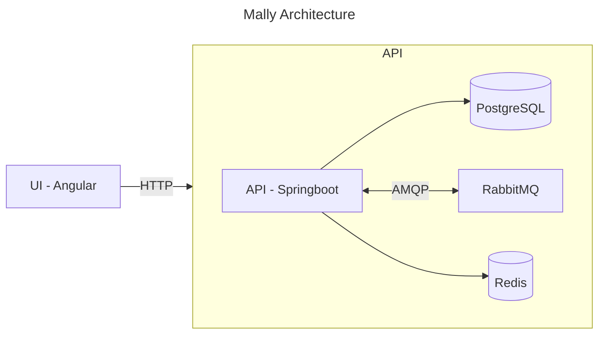

<!--suppress HtmlDeprecatedAttribute -->
<p align="center">
  <a href="">
    
  </a>
</p>

[Mally](https://mally.neumanf.com)  is a web application that provides a collection of web services, including a URL shortener and a Pastebin-like service for sharing text and code snippets. It uses Angular for the frontend and Spring Boot for a modular monolith in the backend, along with Keycloak managing authentication, RabbitMQ handling message queuing, and PostgreSQL for data storage. It also has automated testing with Cypress and a fully configured CI/CD pipeline with GitHub Actions.

## Key Features

-  URL Shortener with QR Code for easy copy and share
-  Pastebin supporting over 10 programming languages
-  Dashboard with statistics about your usage
-  Management page for viewing, creating, updating and deleting data
-  Authentication

## Folder structure

```lua
mally
|
├── apps     -- Main folder where the application code is located
|   ├── ui          -- Angular front-end application
|   └── api         -- Spring Boot back-end application
├── infra    -- Infraesctructure-related Docker files and configuration 
|    ├── keycloak   -- Keycloak themes and configuration
|    ├── nginx      -- Nginx configuration files and scripts
|    └── postgres   -- PostgreSQL scripts
└── scripts  -- Development scripts
```

## Architecture



## License

Mally is licensed under the [MIT License](LICENSE).
