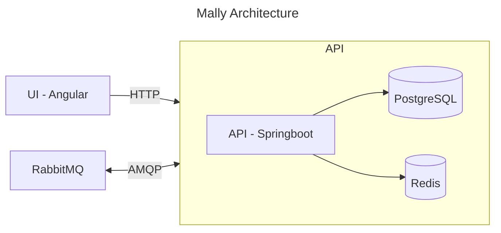

<!--suppress HtmlDeprecatedAttribute -->

  

<h1 align="center">
Mally
</h1>
<h4 align="center">
A collection of open source web services 
</h4>

## Features

-   URL Shortener and Pastebin services
-   CI/CD
-   Tests

## Stack

-   **Frontend:** Angular and PrimeNG.
-   **Backend:** Springboot, RabbitMQ, PostgreSQL and Redis.

## Architecture

## License

Mally is licensed under the [MIT License](LICENSE).
